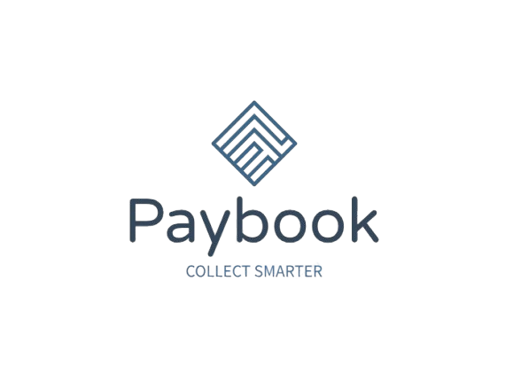

<div align="center">



### Collect smarter.

**One account number. Every payment, accounted for.**

Paybook turns informal payment collections — rent, cooperative dues, subscriptions, installment plans — into structured, self-reconciling ledgers built on [Nomba Virtual Accounts](https://developer.nomba.com).

[](https://nextjs.org)
[](https://www.typescriptlang.org)
[](https://www.prisma.io)
[](https://developer.nomba.com)
[](https://tailwindcss.com)

</div>

---

## The problem

Millions of recurring payments are collected informally: a landlord with three tenants, a cooperative coordinator with forty members, a seller running installment plans. The money moves by bank transfer — but the *record* lives in WhatsApp threads, screenshots, and memory. Nobody can say with certainty who has paid, how much, and what's still owed. Disputes are settled by scrolling.

## The product

Paybook gives every collection of payments a **Collection**: a structured ledger with its own **permanent bank account number**, provisioned through Nomba's virtual account infrastructure. Payers join through an invite link, pay by ordinary bank transfer from any banking app, and every inbound kobo is verified, attributed to the right person, and reflected on both sides' dashboards — automatically.

No screenshots. No "did you get it?". One account number, one source of truth.

```
 Owner creates a Collection ──► dedicated virtual account, instantly
 Owner shares one invite link ──► payers join in under a minute
 Payers transfer from any bank ──► webhook verified, matched, ledgered
 Both dashboards update ──► everyone sees the same truth
```

## Core capabilities

| | |
|---|---|
| 🏦 **Virtual accounts as infrastructure** | Each Collection gets a permanent Nomba virtual account; each payer can be issued their own personal account number for exact, zero-heuristic attribution |
| 🔗 **Owner-bound settlement** | Owners connect their own Nomba business account (credentials verified live, encrypted at rest with AES-256-GCM) — funds settle **directly into the owner's account**. Paybook never holds money |
| 🧠 **Self-reconciling payments** | Signed webhooks (HMAC-SHA256) are verified, deduplicated by idempotency key, and matched to payers by dedicated account or sender identity — processed exactly once |
| 🤝 **Claim-and-bind onboarding** | No bank forms. A payer's sending account is learned from the bank's own webhook data at their first confirmed payment, then every future transfer matches instantly |
| 📊 **Installments, part-payments, overflow** | Percentage-based installment schedules per payer (clock starts at joining), partial payments tracked to the kobo, and overpayments that cascade into future installments — any residue surfaces as visible credit, never silently absorbed |
| 🧾 **An append-only ledger** | Every transaction is permanent record: sender, amount, timestamp, attribution. Unmatched payments land in a review queue where the payer claims or the owner assigns — nothing is ever lost |
| 📣 **Broadcasts & notifications** | Owners message all or selected payers per Collection; both sides get a live in-app notification feed (payments, joins, broadcasts, exits) |
| 🚪 **Formalized exits** | Either side can initiate a disconnection with a 7-day grace window, revocation rights, and notifications at every step — the record is formalized, the relationship stays human |

## Architecture

Two services, one source of truth:

```
┌────────────────────────────┐        ┌──────────────────────────────┐
│  apps/web · Next.js 15     │        │  apps/webhook-service        │
│  Vercel                    │        │  Express · Render            │
│                            │        │                              │
│  Dashboards (owner/payer)  │        │  POST /webhooks/nomba        │
│  Collections & invites     │        │   1. HMAC signature verify   │
│  Nomba account binding     │        │   2. Idempotency (requestId) │
│  Claim / assign / exits    │        │   3. Attribute → apply →     │
│  Broadcasts & notifications│        │      notify, in one txn      │
└─────────────┬──────────────┘        └──────────────┬───────────────┘
              │       shared Prisma schema & logic   │
              └───────────────┬──────────────────────┘
                    ┌─────────▼─────────┐
                    │   packages/db     │
                    │ PostgreSQL (Supabase)
                    │ payment-application.ts — one
                    │ engine for webhook, claim & assign
                    └───────────────────┘
```

**Why a dedicated webhook service?** Payment ingestion is the one path that must never miss. It runs as an always-on process — independent of serverless cold starts and execution limits — and does the entire verify → dedupe → match → apply → notify pipeline synchronously inside a single database transaction before acknowledging.

**Payment attribution, in order of certainty:**
1. **Personal virtual account** — the receiving account reference maps to exactly one enrollment. No inference.
2. **Sender-account match** — the sender's account number matches an account previously bound to a payer in that Collection.
3. **Review queue** — surfaced to both sides; a payer's one-tap claim (or the owner's assignment) applies the payment *and* binds the sender account for the future.

The reconciliation engine (`packages/db/src/payment-application.ts`) is shared verbatim by all three paths — the installment cascade and overpayment rollover behave identically no matter how a payment was attributed.

## Stack

| Layer | Technology |
|---|---|
| Frontend & API | Next.js 15 (App Router, Server Components), Tailwind CSS v4, hand-built design system |
| Payment ingestion | Express (TypeScript), structured JSON logging, split liveness/diagnostic health checks |
| Data | PostgreSQL (Supabase) via Prisma — one schema, two consumers |
| Payments | Nomba: OAuth2 client-credentials, Virtual Accounts API, signed webhooks |
| Auth | Auth.js v5 (JWT), bcrypt, verified-before-stored Nomba credential binding |
| Caching | Upstash Redis (Nomba token cache, keyed per account + environment) |
| Email | Resend (verification, password reset) |
| Monorepo | Turborepo |

## Getting started

```bash
git clone https://github.com/0xElyte/Paybook.git && cd Paybook
npm install

# configure
cp .env.example .env        # fill in credentials (see below)

# database
cd packages/db
npx prisma migrate deploy && npx prisma generate
cd ../..

# run both services
npm run dev                 # web on :3002, webhook service on :3001
```

### Environment

| Variable | Purpose |
|---|---|
| `NOMBA_BASE_URL` | Nomba API host (`https://api.nomba.com/v1`) |
| `NOMBA_ACCOUNT_ID` / `NOMBA_CLIENT_ID` / `NOMBA_CLIENT_SECRET` | Platform Nomba credentials (owners bind their own at onboarding) |
| `NOMBA_SUB_ACCOUNT_ID` | Default settlement sub-account |
| `NOMBA_VA_STRATEGY` | `per_payer` (personal account per enrollment) or `shared` |
| `NOMBA_WEBHOOK_SECRET` | Webhook signature key |
| `PAYBOOK_ENCRYPTION_KEY` | AES-256-GCM key for credentials at rest (`openssl rand -hex 32`) |
| `DATABASE_URL` / `DIRECT_URL` | Pooled / direct PostgreSQL connections |
| `AUTH_SECRET` / `NEXTAUTH_URL` | Session signing |
| `UPSTASH_REDIS_REST_URL` / `UPSTASH_REDIS_REST_TOKEN` | Token cache |
| `RESEND_API_KEY` / `RESEND_FROM_EMAIL` | Transactional email |

## Security posture

- **Zero custody**: virtual accounts are provisioned with the owner's own Nomba credentials; funds route to the owner, never through Paybook.
- **Credentials verified, then encrypted**: owner credentials are validated against Nomba's live token endpoint before storage, encrypted with AES-256-GCM, and never returned by any endpoint or written to any log.
- **Webhook integrity**: HMAC-SHA256 signature verification (constant-time comparison), idempotency enforced by a unique database constraint, at-least-once delivery handled exactly once.
- **No self-declared bank data**: payer bank identity comes from the bank rails themselves via signed webhook payloads.
- **Append-only money trail**: financial records are never deleted; every state change is a status transition with a timestamp.

## Repository layout

```
apps/
  web/               Next.js — dashboards, onboarding, collections, notifications
  webhook-service/   Express — payment ingestion pipeline
packages/
  db/                Prisma schema, migrations, shared payment-application engine
```

---

<div align="center">

**Paybook** — every naira, accounted for.

Built on <a href="https://nomba.com">Nomba</a> payment infrastructure.

</div>
